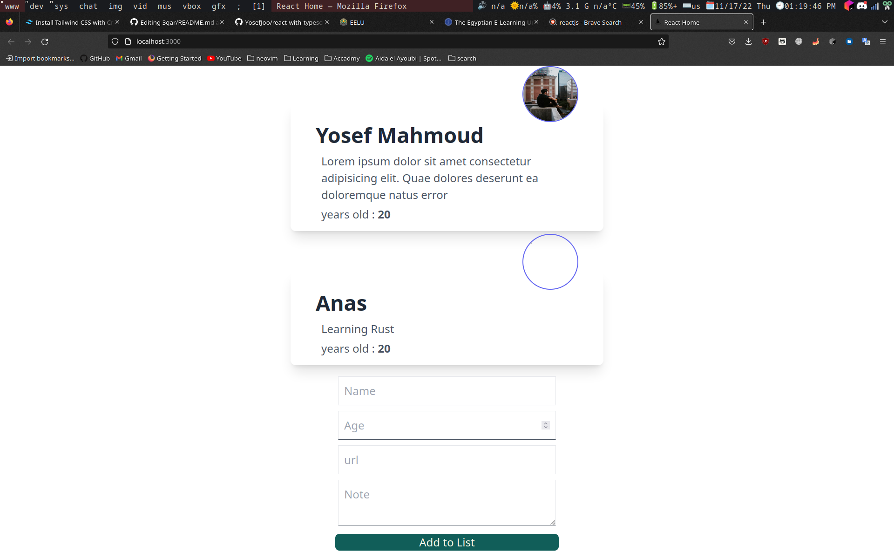

## Getting Started

First, run the development server:

```bash
npm start
# or
yarn start
```

Open [http://localhost:3000](http://localhost:3000) with your browser to see the result.

You can start editing the page by modifying `pages/Home.tsx`. The page auto-updates as you edit the file.

## Resources
- [Learn React.js](https://reactjs.org/) - an interactive react.js tutorial.
- [tailwindcss](https://tailwindcss.com/docs/)

You can check out [the Next.js GitHub repository](https://github.com/vercel/next.js/) - your feedback and contributions are welcome!

### Image


